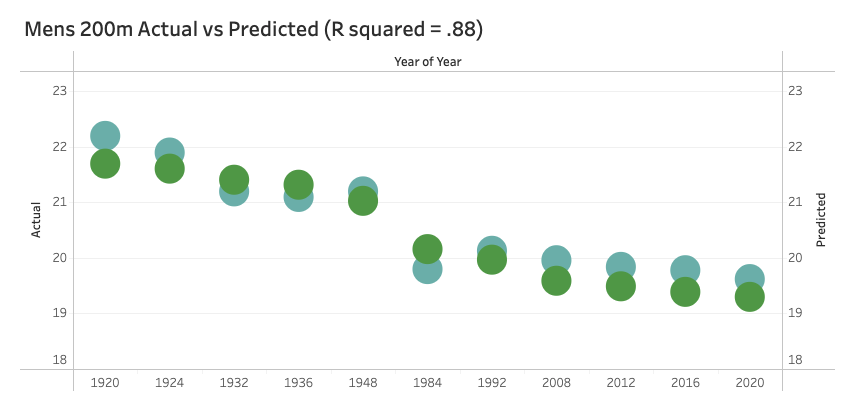

# Machine Learning - Linear Regression Model

## What will be the time that wins the gold?
Using historic olympic data as far back as 1800s-2016, I used a linear regression model to predict what time will win the gold medal for two seperate events in the 2020 (2021) olympics.  I chose Mens 200m and 100m to predict.

To accomplish this I used the following technologies:
 - Python Environmnet
 - Jupyter Notebook
 - Pandas 
 - ScikitLearn (Sklearn)
 - Linear Regression Algorithm 
 - Numpy, scipy.stats 
 - Tableau 

See visualization here:  https://public.tableau.com/shared/RQKKQFHRP?:display_count=n&:origin=viz_share_link)

### Enjoy :)
